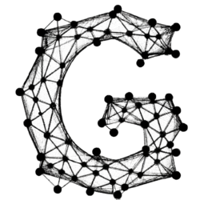

#  Graaf
[](https://github.com/bobluppes/graaf/actions/workflows/main-ci.yml)
[](https://codecov.io/github/bobluppes/graaf)
[](https://bobluppes.github.io/graaf/)

Graaf is a general-purpose lightweight C++ library designed for versatile graph operations. Graaf allows users to easily create, modify, and query graphs. It is well-suited for various graph-based applications, including social network analysis, CNNs, and more.

## Features
The Graaf library is designed with generality in mind. As such, it comes with specializations for a `directed_graph` as well as an `undirected_graph`. Furthermore, it can be used to store user-defined vertex and edge classes:

```c++
graaf::undirected_graph<User, Connection> my_graph{};

const auto bob = my_graph.add_vertex(User{
  .name = "Bob",
  .age = 42
});

const auto alice = my_graph.add_vertex(User{
  .name = "Alice",
  .age = 33
});

my_graph.add_edge(bob, alice, Connection{
  .type = connection_type::FRIENDS
});
```

Implementations for common graph algorithms are provided under the `algorithm` namespace. For instance, there is support for traversing a graph using *depth-first search* and *breadth-first search* strategies.

```c++
const auto print_vertex_callback{[](const auto vertex) {
  std::cout << vertex << std::endl;
}};

traverse<search_strategy::BFS>(my_graph, start_vertex, print_vertex_callback);
```

For more details, take a look at the [documentation](https://bobluppes.github.io/graaf/).

## Requirements
- C++ 20

## Installation
This project supports CMake and can be pulled in using `FetchContent`:

```CMake
include(FetchContent)
FetchContent_Declare(
  graaflib
  GIT_REPOSITORY https://github.com/bobluppes/graaf.git
  GIT_TAG        main
)
FetchContent_MakeAvailable(graaflib)
```

Now you can link your target against `Graaf_lib`:

```CMake
target_link_libraries(${PROJECT_NAME} PRIVATE Graaf_lib)
```

## Contributing
The Graaf library is open to contributions, learn more [here](CONTRIBUTING.md).

## License
This project is licensed under the [MIT license](LICENSE.md).
