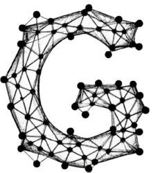
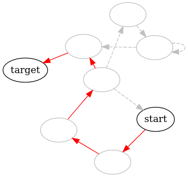

<p align="center"></p>
<h1 align="center">Graaf Lib</h1>

<p align="center">
  Graaf is a general-purpose header-only graph library implemented in C++. It is designed as a lightweight alternative to the <a href="https://www.boost.org/doc/libs/1_82_0/libs/graph/doc/index.html">Boost Graph Library (BGL)</a>.
</p>

<br/>

<p align="center">
  <a href="https://github.com/bobluppes/graaf/actions/workflows/main-ci.yml"></a>
  <a href="https://codecov.io/github/bobluppes/graaf"></a>
  <a href="https://bobluppes.github.io/graaf/"></a>
  <a href="https://github.com/bobluppes/graaf/wiki"></a>
</p>

<p align="center">
  <a href="https://discord.gg/cGczwRHJ9K"></a>
  <a href="https://GitHub.com/bobluppes/graaf/releases/"></a>
  <a href="LICENSE.md"></a>
</p>

<p align="center">
  
</p>

# About
Using the Graaf library is easy! Specializations are provided for a `directed_graph` as well as for `undirected_graph`. To create your first graph: 

```c++
undirected_graph<int, float> my_graph{};
```

This creates an undirected graph with `int`eger values on the vertices and `float` weights on the edges. Graaf is designed with generality in mind. As such, it can be used to store any user-defined vertex and edge class:

```c++
struct User {
  std::string name;
  int age;
};

// An edge type can also be unweighted if we don't derive from weighted_edge
struct Connection : public weighted_edge<float> {
  float strength;
  float get_weight() const override { return strength; }
};

undirected_graph<User, Connection> my_graph{};
```

Implementations for common [graph algorithms](#algorithms) are provided under the `algorithm` namespace. Combining this with built-in `dot` format support allows us to do things like visualizing the shortest path between two vertices:

<p align="center">

</p>

To get started, take a look at our [quickstart guide](https://bobluppes.github.io/graaf/docs/quickstart/intro).

# Installation
The most straightforward way to use the Graaf in your project is to include it as a header-only library. Please take a look at the [installation guide](https://bobluppes.github.io/graaf/docs/quickstart/installation) for alternative installation methods.

## Header-Only Library
The Graaf libary can be included as a header-only library. All it requires is a compiler with C++ 20 support.

Download the `header-only` library from our [release page](https://github.com/bobluppes/graaf/releases) and add the `include/graaflib` directory to your include path. You can now use Graaf in your source files:

```c++
// main.cpp
#include <graaflib/directed_graph>
```

For more details or alternative installation methods, see the [installation guide](https://bobluppes.github.io/graaf/docs/quickstart/installation).

# Algorithms
Algorithms implemented in the Graaf library include the following. For more information on individual algorithms please take a look at the [docs](https://bobluppes.github.io/graaf/docs/algorithms/intro).

1. [**Traversal Algorithms**](https://bobluppes.github.io/graaf/docs/category/traversal-algorithms):
    - Breadth-First Search (BFS)
    - Depth-First Search (DFS)
2. [**Shortest Path Algorithms**](https://bobluppes.github.io/graaf/docs/category/shortest-path-algorithms):
    - BFS-Based Shortest Path

# Contributing
The Graaf library welcomes contributions 🎊 

If you're interested in improving, fixing bugs, or adding features, please refer to the [wiki](https://github.com/bobluppes/graaf/wiki) for guidelines. Check out our roadmap on [YouTrack](https://graaf.youtrack.cloud/agiles/147-2/current) to stay up to date on planned features and improvements. We also have an [issue tracker](https://github.com/bobluppes/graaf/issues) for bug reports and feature requests. 

Feel free to join our [Discord](https://discord.gg/cGczwRHJ9K) for assistance and a smooth contribution experience.

# License
This project is licensed under the [MIT license](LICENSE.md).
