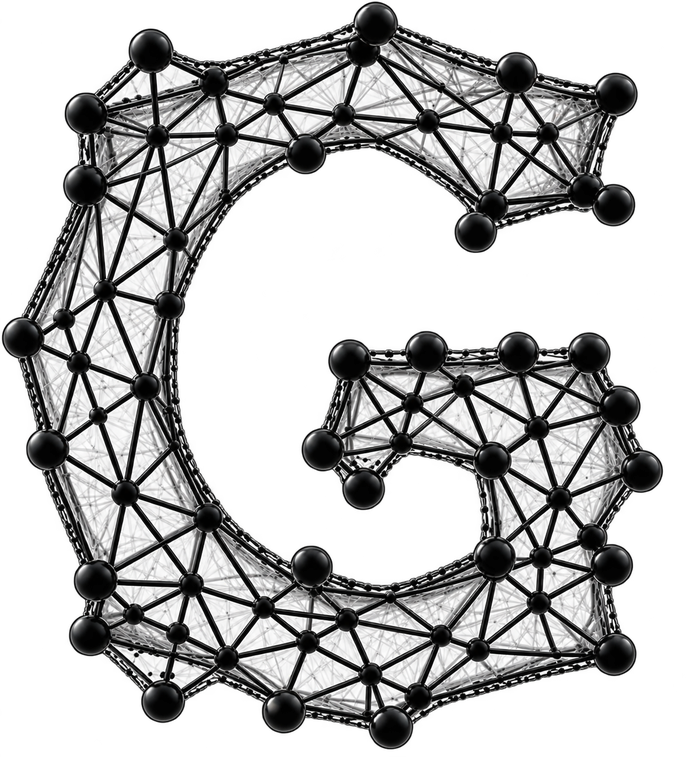
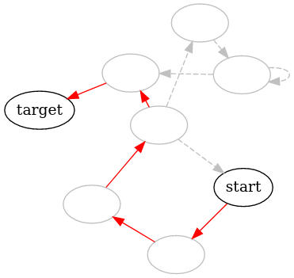

<p align="center"></p>
<h1 align="center">Graaf Library</h1>

<p align="center">
  Graaf is a <b>general-purpose header-only graph library</b> implemented in C++. It is designed as a lightweight alternative to the <a href="https://www.boost.org/doc/libs/1_82_0/libs/graph/doc/index.html">Boost Graph Library (BGL)</a>.
</p>

<br/>

<p align="center">
  Want to try Graaf without installing anything? Give it a spin on <a href="https://godbolt.org/z/dxnf7bzMc">Compiler Explorer</a>!
</p>

<p align="center">
  <a href="https://github.com/bobluppes/graaf/actions/workflows/main-ci.yml"></a>
  <a href="https://codecov.io/github/bobluppes/graaf"></a>
  <a href="https://bobluppes.github.io/graaf/"></a>
</p>

<p align="center">
  <a href="https://discord.gg/cGczwRHJ9K"></a>
  <a href="https://GitHub.com/bobluppes/graaf/releases/"></a>
  <a href="LICENSE.md"></a>
</p>

<p align="center">

</p>

# About

Graph is an abstract data type that is widely used in computer science. It is a collection of vertices (nodes) and edges
that connect these vertices. Graphs are used to model many real-world problems, such as social networks, road networks,
and computer networks. As such, graph algorithms are used in many applications, including route planning, network
analysis, and data mining.

Graaf: A Lightweight, Header-Only C++20 Graph Library

**Key Features**:

- **Header-only**: No separate compilation or linking required.
- **Generality**: Supports user-defined vertex and edge classes.
- **Algorithm Support**: Provides a range of graph algorithms.

**Purpose**:
Graaf is designed with the goal of simplifying graph-related tasks. It offers a lightweight alternative to the [Boost Graph Library (BGL)](https://www.boost.org/doc/libs/1_82_0/libs/graph/doc/index.html) and is built for simplicity and extensibility. With Graaf, you can easily create, manipulate, and analyze graphs, making it suitable for a wide range of applications.

# Installation

The most straightforward way to use the Graaf in your project is to include it as a header-only library. Please take a
look at the [installation guide](https://bobluppes.github.io/graaf/quickstart/installation/) for alternative
installation methods.

## Header-Only Library

The Graaf library can be included as a header-only library. All it requires is a compiler with **C++ 20 support**.

Download the `header-only` library from our [release page](https://github.com/bobluppes/graaf/releases) and add
the `include/graaflib` directory to your include path. You can now use Graaf in your source files:

```c++
// main.cpp
#include <graaflib/directed_graph>
```

For more details or alternative installation methods, see
the [installation guide](https://bobluppes.github.io/graaf/quickstart/installation/).

# How to use Graaf

Using the Graaf library is easy! Specializations are provided for a `directed_graph` as well as for `undirected_graph`.
To create your first graph:

```c++
undirected_graph<int, float> my_graph{};
```

This creates an undirected graph with `integer` values on the vertices and `float` weights on the edges. Graaf is
designed with generality in mind. As such, it can be used to store any user-defined vertex and edge class:

```c++
struct User {
  std::string name;
  int age;
};

// An edge type can also be unweighted if we don't derive from weighted_edge
struct Connection : public weighted_edge<float> {
  float strength;
  float get_weight() const override { return strength; }
};

undirected_graph<User, Connection> my_graph{};
```

Implementations for common [graph algorithms](#algorithms) are provided under the `algorithm` namespace. Combining this
with built-in `dot` format support allows us to do things like visualizing the shortest path between two vertices:

<p align="center">

</p>

To get started, take a look at our [quickstart guide](https://bobluppes.github.io/graaf/quickstart/intro.html).

# Algorithms

Algorithms implemented in the Graaf library include the following. For more information on individual algorithms please
take a look at the [docs](https://bobluppes.github.io/graaf/algorithms/intro.html).

1. [**Cycle Detection Algorithms**](https://bobluppes.github.io/graaf/algorithms/cycle-detection/):
   - [DFS-Based Cycle Detection](https://bobluppes.github.io/graaf/algorithms/cycle-detection/dfs-based.html)
2. [**Graph Coloring Algorithms**](https://bobluppes.github.io/graaf/algorithms/coloring/):
   - [Greedy Graph Coloring](https://bobluppes.github.io/graaf/algorithms/coloring/greedy-graph-coloring.html)
   - [Welsh-Powell Algorithm]
3. [**Minimum Spanning Tree (MST) Algorithms**](https://bobluppes.github.io/graaf/algorithms/minimum-spanning-tree/)
   - [Kruskal's Algorithm](https://bobluppes.github.io/graaf/algorithms/minimum-spanning-tree/kruskal.html)
   - [Prim's Algorithm](https://bobluppes.github.io/graaf/algorithms/minimum-spanning-tree/prim.html)
4. [**Shortest Path Algorithms**](https://bobluppes.github.io/graaf/algorithms/shortest-path/):
   - [A\* search](https://bobluppes.github.io/graaf/algorithms/shortest-path/a-star.html)
   - [Bellman-Ford Shortest Path](https://bobluppes.github.io/graaf/algorithms/shortest-path/bellman-ford.html)
   - [BFS-Based Shortest Path](https://bobluppes.github.io/graaf/algorithms/shortest-path/bfs-based-shortest-path.html)
   - [Dijkstra Shortest Path](https://bobluppes.github.io/graaf/algorithms/shortest-path/dijkstra.html)
   - [Floyd-Warshall Algorithm](https://bobluppes.github.io/graaf/algorithms/shortest-path/floyd-warshall.html)
5. [**Strongly Connected Components Algorithms**](https://bobluppes.github.io/graaf/algorithms/strongly-connected-components/):
   - [Tarjan's Strongly Connected Components](https://bobluppes.github.io/graaf/algorithms/strongly-connected-components/tarjan.html)
   - [Kosaraju's Strongly Connected Components](https://bobluppes.github.io/graaf/algorithms/strongly-connected-components/kosarajus.html)
6. [**Topological Sorting Algorithms**](https://bobluppes.github.io/graaf/algorithms/topological-sort/topological-sort.html):
7. [**Traversal Algorithms**](https://bobluppes.github.io/graaf/algorithms/traversal/):
   - [Breadth-First Search (BFS)](https://bobluppes.github.io/graaf/algorithms/traversal/breadth-first-search.html)
   - [Depth-First Search (DFS)](https://bobluppes.github.io/graaf/algorithms/traversal/depth-first-search.html)
8. [**Clique Detection**](https://bobluppes.github.io/graaf/algorithms/clique-detection/)
    - [Bron-Kerbosch](https://bobluppes.github.io/graaf/algorithms/clique-detection/bron_kerbosch.html)

# Contributing

The Graaf library welcomes contributions 🎊

If you're interested in improving, fixing bugs, or adding features, please refer to
the [development docs](https://bobluppes.github.io/graaf/development/intro.html) for guidelines and have your [development environment set up](https://bobluppes.github.io/graaf/development/contributing/development-setup.html) before you start. Check out our roadmap
on [YouTrack](https://graaf.youtrack.cloud/agiles/147-2/current) to stay up to date on planned features and
improvements. We also have an [issue tracker](https://github.com/bobluppes/graaf/issues) for bug reports and feature
requests.

Feel free to join our [Discord](https://discord.gg/cGczwRHJ9K) for assistance and a smooth contribution experience.

### Contributors

<a href="https://github.com/bobluppes/graaf/graphs/contributors">
  
</a>

# License

This project is licensed under the [MIT license](LICENSE.md).
