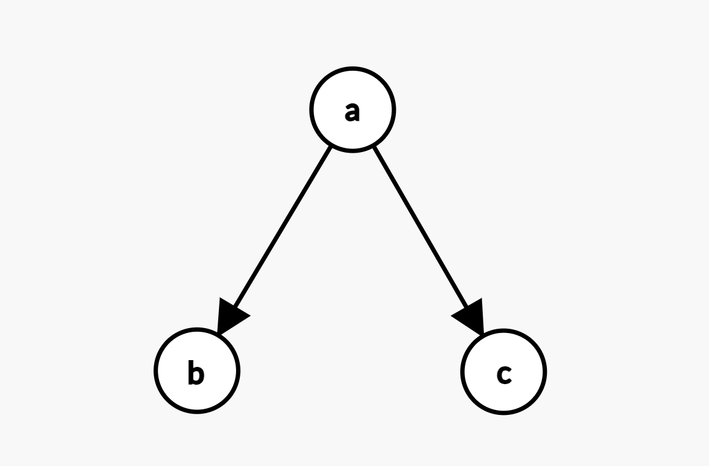

# Creating Your First Graph

1. In your `main.cpp` import Graaf:

```c++
#include <graaflib/graph.h>
```

2. Define a directed graph `g`

```c++
graaf::directed_graph<const char, int> g;
```

3. Add vertices to the graph:

```c++
const auto a = g.add_vertex('a');
const auto b = g.add_vertex('b');
const auto c = g.add_vertex('c');
```

4. Connect the vertices with edges:

```c++
g.add_edge(a, b, 1);
g.add_edge(a, c, 1);
```

5. Putting it all together:

```c++
#include <graaflib/graph.h>

int main()
{
    graaf::directed_graph<const char, int> g;

    const auto a = g.add_vertex('a');
    const auto b = g.add_vertex('b');
    const auto c = g.add_vertex('c');

    g.add_edge(a, b, 1);
    g.add_edge(a, c, 1);

    return 0;
}
```

### Congratulations! You just created the following graph 🎉


