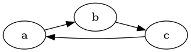

# Using Algorithms

1. In your `main.cpp` import Graaf and algorithm of choice:

```c++
#include <graaflib/graph.h>
#include <graaflib/algorithm/cycle_detection/dfs_cycle_detection.h>
```

2. Build your graph:

```c++
graaf::directed_graph<const char, int> g;

const auto a = g.add_vertex('a');
const auto b = g.add_vertex('b');
const auto c = g.add_vertex('c');

g.add_edge(a, b, 1);
g.add_edge(c, a, 1);
```

3. Run the algorithm:

```c++
std::cout << "Has cycles: " << graaf::algorithm::dfs_cycle_detection(g) << "\n";
```

4. Visualize the graph:

```c++
#include <graaflib/io/dot.h>
...
graaf::io::to_dot(g, "./Cycles.dot");
```

5. Putting it all together:

```c++
#include <graaflib/graph.h>
#include <graaflib/io/dot.h>
#include <graaflib/algorithm/cycle_detection/dfs_cycle_detection.h>

#include <iostream>

int main(int argc, char** argv)
{
    graaf::directed_graph<const char, int> g;

    const auto a = g.add_vertex('a');
    const auto b = g.add_vertex('b');
    const auto c = g.add_vertex('c');

    g.add_edge(a, b, 1);
    g.add_edge(c, a, 1);

    std::cout << "Vertices: " << g.vertex_count() << "\n";
    std::cout << "Edges: " << g.edge_count() << "\n";

    std::cout << "Has cycles: " << graaf::algorithm::dfs_cycle_detection(g) << "\n";

    g.add_edge(b, c, 1);
    std::cout << "Has cycles: " << graaf::algorithm::dfs_cycle_detection(g) << "\n";

    graaf::io::to_dot(g, "./Cycles.dot");
    std::cout << "Run: dot -Tpng -o Cycles.png Cycles.dot\n";
    
    return 0;
}

```

### Congratulations! You just detected if there are cycles in the following graph


