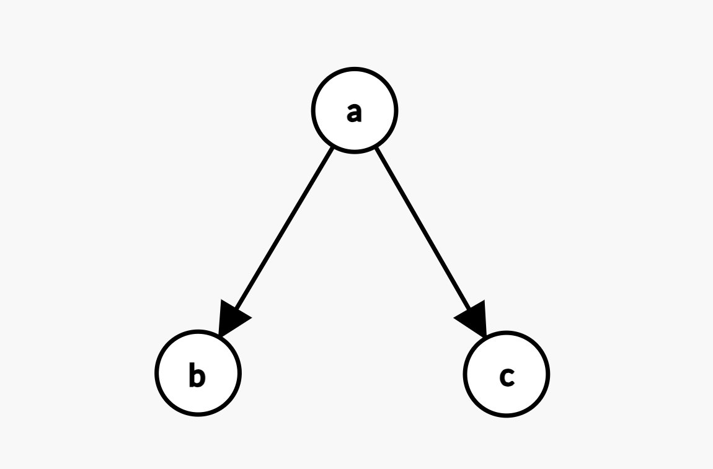

# Creating Your First Graph

1. In your `main.cpp` import Graaf:

```c++
#include <graaflib/graph.h>
```

2. Define a directed graph `g`

```c++
graaf::directed_graph<const char, int> g;
```

3. Add vertices to the graph:

```c++
const auto a = g.add_vertex('a');
const auto b = g.add_vertex('b');
const auto c = g.add_vertex('c');
```

4. Connect the vertices with edges:

```c++
g.add_edge(a, b, 1);
g.add_edge(a, c, 1);
```

5. Putting it all together:

```c++
#include <graaflib/graph.h>

int main()
{
    graaf::directed_graph<const char, int> g;

    const auto a = g.add_vertex('a');
    const auto b = g.add_vertex('b');
    const auto c = g.add_vertex('c');

    g.add_edge(a, b, 1);
    g.add_edge(a, c, 1);

    return 0;
}
```

### Congratulations! You just created the following graph 🎉



## Importing data with existing IDs

`add_vertex()` always has the graph assign the new vertex's ID, so IDs stay
densely packed. If you're importing data that already has its own IDs (e.g.
row numbers from a database, or IDs from a file format), keep a map from
those external IDs to the graph-assigned `vertex_id_t`s and use it to
translate IDs when adding edges:

```c++
std::unordered_map<int, graaf::vertex_id_t> external_id_to_vertex_id;

for (const auto& record : records) {
    const auto vertex_id = g.add_vertex(record.data);
    external_id_to_vertex_id[record.external_id] = vertex_id;
}

for (const auto& [from_external_id, to_external_id] : record_links) {
    g.add_edge(external_id_to_vertex_id.at(from_external_id),
              external_id_to_vertex_id.at(to_external_id), 1);
}
```
